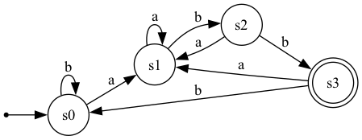

# regex-engine

A regex engine built from scratch in C++17 — no `<regex>`, no third-party
libraries. It implements the classic compiler-theory pipeline:

```
pattern string
      │  Parser (recursive descent)
      ▼
   AST
      │  ThompsonBuilder (Thompson's construction)
      ▼
   NFA  (epsilon transitions allowed)
      │  DFABuilder (subset / powerset construction)
      ▼
   DFA
      │  minimizeDFA (Moore's algorithm / partition refinement)
      ▼
 minimal DFA  ──►  O(n) matching, no backtracking
```

Everything lives in a single header, `include/regex_engine.hpp`, so you can
drop it into any project with `#include "regex_engine.hpp"`.

## Requirements

- A C++17-compliant compiler — tested with **g++ 11+** (also works with
  clang++ 12+). No special flags needed beyond `-std=c++17`.
- No external dependencies — no Boost, no PCRE, no `<regex>`. Just the
  standard library (`<bitset>`, `<unordered_map>`, `<map>`, `<set>`,
  `<queue>`, `<memory>`, `<optional>`).
- `make` / GNU Make (optional — you can equally well invoke `g++` directly).
- *(Optional)* [Graphviz](https://graphviz.org/) if you want to render the
  `.dot` output of `re.dot()` into an actual image.

## Supported syntax

| Syntax        | Meaning                                   |
|---------------|--------------------------------------------|
| `a`           | literal character                          |
| `ab`          | concatenation                              |
| `a\|b`        | alternation                                |
| `a*`          | zero or more                               |
| `a+`          | one or more                                |
| `a?`          | zero or one                                |
| `(...)`       | grouping                                   |
| `.`           | any byte except `\n`                       |
| `[abc]`       | character class                            |
| `[a-z]`       | character range                            |
| `[^abc]`      | negated character class                    |
| `\d \D`       | digit / non-digit                          |
| `\w \W`       | word char / non-word char                  |
| `\s \S`       | whitespace / non-whitespace                |
| `\. \* \( ...`| escaped metacharacters                     |

## Pipeline in detail

1. **Parser** (`Parser`) — hand-written recursive descent over the grammar
   `union → concat → repeat → atom`, giving `|` the lowest precedence,
   implicit concatenation next, and postfix `* + ?` the highest. Character
   classes and shorthand escapes are parsed directly into `std::bitset<256>`
   masks on `Node`.

2. **Thompson's construction** (`ThompsonBuilder`) — recursively turns each
   AST node into a small NFA "fragment" with one dangling start state and one
   dangling accept state, then wires fragments together with epsilon edges
   using the standard rules for concatenation, union, star, plus and
   optional. This is the textbook construction from Ken Thompson's 1968
   paper, and always produces an NFA with at most 2 states per AST node.

3. **Subset construction** (`DFABuilder`) — the powerset construction:
   starting from the epsilon-closure of the NFA start state, repeatedly
   computes, for every reachable set of NFA states and every input byte, the
   epsilon-closure of where that byte can take you. Each distinct *set* of
   NFA states becomes one DFA state, removing the non-determinism (and the
   epsilon transitions) entirely.

4. **Minimization** (`minimizeDFA`) — Moore's algorithm: states start
   partitioned into "accepting" / "non-accepting", then the partition is
   refined repeatedly (two states stay together only if every input byte
   sends them to the *same* group) until it stabilizes. The result is the
   unique minimal-state DFA for the language.

5. **Matching** (`DFA::fullMatch` / `DFA::search`) — once you have a DFA,
   matching is just following one array lookup (`trans[256]` per state) per
   input byte — no backtracking, no recursion.

## API

```cpp
#include "regex_engine.hpp"
using rgx::Regex;

Regex re("[A-Za-z_][A-Za-z0-9_]*");   // compiles pattern -> AST -> NFA -> DFA -> minimal DFA

re.fullMatch("hello_world");          // true  -- entire string must match (like ^...$)
re.search("2 cats, 1 dog");           // true  -- pattern occurs somewhere
re.find("2 cats, 1 dog");             // optional<pair<size_t,size_t>> first match span
re.findAll("a1 b2 c3");               // vector of all non-overlapping match spans

re.nfaStateCount();                   // size of the Thompson NFA
re.dfaStateCount();                   // size of the minimized DFA
re.dot();                             // Graphviz "dot" source for visualizing the DFA
```

Construct with `Regex(pattern, /*minimize=*/false)` to skip minimization and
inspect the raw subset-construction DFA.

## Build & run

```sh
make           # builds ./regex_demo
make run       # builds and runs the built-in test suite + demos
```

or directly:

```sh
g++ -std=c++17 -O2 -o regex_demo src/main.cpp
./regex_demo                              # runs 44 built-in test cases
./regex_demo '[a-z]+@[a-z]+\.[a-z]+' 'me@example.com'   # ad-hoc single check
```

### Example programs

`examples/` contains two small standalone programs that exercise the API in
isolation:

```sh
# Compiles a pattern and prints its minimized DFA as Graphviz dot syntax
g++ -std=c++17 -O2 -o smartwater examples/smartwater.cpp
./smartwater > smartwater-dfa.dot
dot -Tpng smartwater-dfa.dot -o smartwater-dfa.png

# Minimal smoke test: compile a pattern, run a couple of matches, print state counts
g++ -std=c++17 -O2 -o sandbox examples/sandbox.cpp
./sandbox
```

## Example: `(a|b)*abb`

This is the canonical example from the Dragon Book. The Thompson
construction produces 14 NFA states; subset construction collapses these
into a handful of DFA states, and minimization brings it down to exactly
**4 states** — matching the textbook result:

```
digraph DFA {
  rankdir=LR;
  s0 [shape=circle];
  s1 [shape=circle];
  s2 [shape=circle];
  s3 [shape=doublecircle];
  start [shape=point];
  start -> s0;
  s0 -> s0 [label="b"];
  s0 -> s1 [label="a"];
  s1 -> s1 [label="a"];
  s1 -> s2 [label="b"];
  s2 -> s1 [label="a"];
  s2 -> s3 [label="b"];
  s3 -> s0 [label="b"];
  s3 -> s1 [label="a"];
}
```

Rendered with Graphviz (`dot -Tpng dfa.dot -o dfa.png`):



## Files

```
include/regex_engine.hpp        the entire engine (parser, NFA, DFA, minimizer)
src/main.cpp                    test suite + CLI demo
examples/smartwater.cpp         prints a pattern's minimized DFA as Graphviz dot
examples/sandbox.cpp            minimal compile-and-match smoke test
smartwater-dfa.dot              Graphviz source for the examples/smartwater.cpp
smartwater-dfa.png              dfa visualization of smartwater-df.dot
Makefile
```